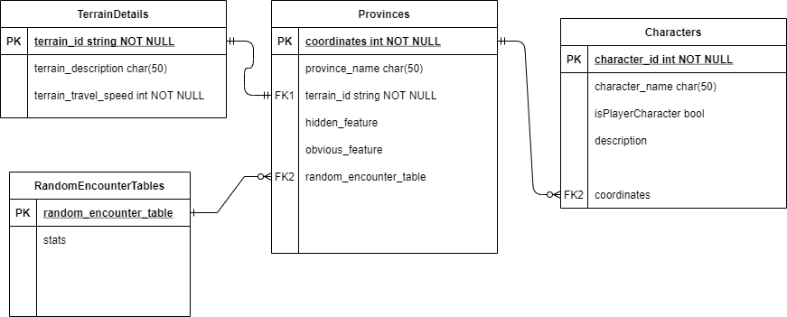

# D&D Campaign Manager
Repository for an app that displays a map of a role-playing game world and automates common features of [hexcrawl](https://www.runagame.net/2014/03/the-hex-crawl.html) or sandbox table-top gameplay style such as; rolling for random encounters, finding travel times between locations. As well as storing information about locations on the map and allowing the dungeon master to edit that information to customize it for their own game and update it as the game progresses. 

Using; C#, WPF, SQL, Microsoft Entity Framework

## Database Entity Relationship Diagram

