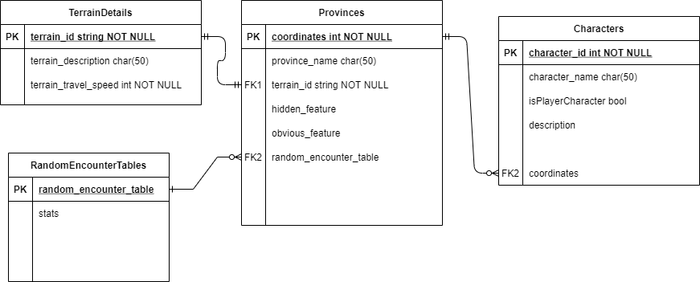

# D&D Campaign Manager
Repository for an app that displays a map of a role-playing game world and automates common features of [hexcrawl](https://www.runagame.net/2014/03/the-hex-crawl.html) or sandbox table-top gameplay style such as; rolling for random encounters, finding travel times between locations. As well as storing information about locations on the map and allowing the dungeon master to edit that information to customize it for their own game and update it as the game progresses. 

Using; C#, WPF, SQL, Microsoft Entity Framework

## Definition Of Done

- [ ] All user stories have been reviewed and are done
- [ ] Readme fully describes app functionality
- [ ] Readme includes breakdown of every sprint
- [ ] Cover all CRUD methods with unit tests
- [ ] Final changes committed to main branch by 9:30 Mon 17ths

## Sprint 1  - 11/05/2021

- [x] Create entity relationship diagram
- [ ] Complete user story 1.1 DM Map View

### Pre-Sprint Project Board

### Database Entity Relationship Diagram

### Sprint Review

During the sprint I realised I needed to alter my user stories, creating one for the DM Map View itself, rather than login functionality which was the initial story 1.1. This became the real focus of the sprint, blocking out the gui. I completed the ERD and blocked out a scaffold for the gui, which I can then proceed to add the underlying functionality to.

### Sprint Retrospective

I had trouble with relative uri's for loading images into the map buttons. In the current state these images are loaded from absolute uri's, which won't be acceptable for the final product. This is something I would like to fix in the next sprint. 

Focussing in particular on the gui to begin with had it's merits and demerits. I chose to do this because working with WPF is the aspect of the project I am least familiar with so I wanted to get it out of the way early and not risk getting stuck on towards the end of the project. However creating the gui in a vacuum was I think harder than expected. Without knowing what the output of functions that would be called from the business/game logic layer it was somewhat difficult to plan. That being said now that I do have a framework for the gui, which can be refactored as I add backend functionality I'm confident that I'll be building exactly those backend functions which I do need and no more.

In the next sprint I will be creating the database and CRUD functions necessary to fully implement User Story 1.1, then moving onto 2.1, which will leave me with a full set of Read and Update functions for viewing and editing province details which will be the main functionality of the app overall.

### Post-sprint Project Board

