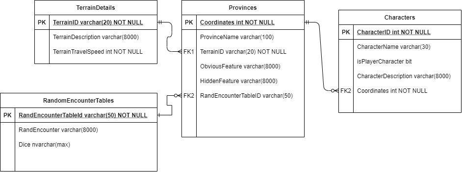

# D&D Campaign Manager

Repository for an app that displays a map of a role-playing game world and automates common features of [hexcrawl](https://www.runagame.net/2014/03/the-hex-crawl.html) or sandbox table-top gameplay style such as; rolling for random encounters, finding travel times between locations. As well as storing information about locations on the map and allowing the dungeon master to edit that information to customize it for their own game and update it as the game progresses. 

## Project Setup

This project uses C# in visual studio 2019, WPF, the NUnit, NUnit3TestAdapter, and Microsoft.NET.Test.Sdk, NuGet packages. As well as the Microsoft.EntityFrameworkCore, Microsoft.EntityFrameworkCore.SqlServer, and Microsoft.EntityFrameworkCore.Tools, NuGet packages.

### NuGet Packages

After downloading the solution you must install the required NuGet packages for each project

There are four projects in the solution

* CampaignManagerData which contains the database model and requires the Microsoft.EntityFrameworkCore, Microsoft.EntityFrameworkCore.SqlServer, and Microsoft.EntityFrameworkCore.Tools, NuGet packages.
* DnDCampaignManagerApp which contains CRUD functions for interacting with the database, no NuGet packages
* DnDCampaignManagerWPF which is a WPF project implementing the GUI, no NuGet packages
* DnDCampaignManagerTests which contains the unit tests for the DnDCampaignManagerApp project. Requires the NUnit, NUnit3TestAdapter, and Microsoft.NET.Test.Sdk NuGet packages.

### Dependencies

Some of these projects have eachother as dependencies. On each project right-click the dependencies and select  `Add project reference`. Ensure that each project has the correct dependencies. 

* CampaignManagerData; No dependencies
* DnDCampaignManagerApp; CampaginManagerData
* DnDCampaignManagerTests; DnDCampaignManagerApp
* DnDCampaignManagerWPF; DnDCampaignManagerApp

### Model First Database Approach

This project also depends on a database. Once you have installed the NuGet packages you can construct this database using EntityFramework.

<- Information here ->

Once the database has been constructed you may populate it with some dummy data using the functions in ``/CampaignManagerData/Program.cs` Note that the provinces table has foreign keys for the other tables, if you wish to include those foreign keys in an entry in provinces you must ensure that the corresponding entry exists in the other tables.

### Entity Framework Diagram and Class Diagram

## Definition Of Done

- [ ] All user stories have been reviewed and are done
- [ ] Readme fully describes app functionality
- [ ] Readme includes breakdown of every sprint
- [ ] Cover all CRUD methods with unit tests
- [ ] Final changes committed to main branch by 9:30 Mon 17ths

## Sprint 1  - 11/05/2021

- [x] Create entity relationship diagram
- [ ] Complete user story 1.1 DM Map View

### Pre-Sprint Project Board

### Database Entity Relationship Diagram

### Sprint Review

During the sprint I realised I needed to alter my user stories, creating one for the DM Map View itself, rather than login functionality which was the initial story 1.1. This became the real focus of the sprint, blocking out the gui. I completed the ERD and blocked out a scaffold for the gui, which I can then proceed to add the underlying functionality to.

### Sprint Retrospective

I had trouble with relative uri's for loading images into the map buttons. In the current state these images are loaded from absolute uri's, which won't be acceptable for the final product. This is something I would like to fix in the next sprint. 

Focussing in particular on the gui to begin with had it's merits and demerits. I chose to do this because working with WPF is the aspect of the project I am least familiar with so I wanted to get it out of the way early and not risk getting stuck on towards the end of the project. However creating the gui in a vacuum was I think harder than expected. Without knowing what the output of functions that would be called from the business/game logic layer it was somewhat difficult to plan. That being said now that I do have a framework for the gui, which can be refactored as I add backend functionality I'm confident that I'll be building exactly those backend functions which I do need and no more.

In the next sprint I will be creating the database and CRUD functions necessary to fully implement User Story 1.1, then moving onto 2.1, which will leave me with a full set of Read and Update functions for viewing and editing province details which will be the main functionality of the app overall.

### Post-sprint Project Board

## Sprint 2 - 12/05/2021

### Goals

- [x] Implement database from entity relationship diagram
- [x] Complete user story 1.1 DM Map View
- [x] Complete user story 2.1 Edit Province Contents

### Pre-Sprint Project Board

### Sprint Review

Implemented database from ERD and all user stories from sprint.

### Sprint Retrospective

This sprint went smoother than the previous one, completed all goals. Overall I'm happy with it.

In the next sprint I will be covering user stories 1.3 and 1.4

### Post-Sprint Project Board

## Sprint 3 - 13/05/2021

### Goals

- [ ] Complete user story 1.3 See Travel Times
- [x] Complete user story 1.4 Automatically Roll Encounters

### Pre-Sprint Project Board

### Sprint Review

Completed user story 1.4, did not complete user story 1.3.

### Sprint Retrospective

Was quite heavily blocked by inexperience with working with JSON in C#, also by altering my database. I added a column to the RandomEncounters table to hold the dice associated with that set of encounters, which made the code around doing this somewhat cleaner. Spent a good hour trying to edit the database, then burn it down such that I could build it again. 

In the future I should become more familiar with methods for dealing with JSON in c#.

I also broke down the acceptance criteria for user stories 1.3 (which was in this sprint and un-completed) as well as the criteria for user story 2.2. Both User Stories were clear but the acceptance criteria was over-broad, lot's of different little bits all in one gherkin statement which meant it was not very clear exactly what the steps would be.

Tomorrow/later today I am going to attempt to go for user story 2.2 (Edit Random Encounter Tables), and generally go about sprucing up the gui from it's rudimentary state right now, this may involve drawing wire-frames.  As well as make sure as much of the CRUD and other logic in DnDCampaignManagerApp is covered in unit tests as possible.

### Post-Sprint Project Board

## Sprint 4 - 14/05/2021

### Goals

- [ ] Complete user story 2.2
- [x] Make the gui look nicer

### Pre-Sprint Project Board

### Sprint Review

Completed work on the gui, prepped my slide for the presentation. Added crud functions necessary for user story 2.2 and created units tests for them which past but the functionality is not implemented in the gui yet. The gui now has a page for this functionality to be implemented

### Sprint Retrospective

Lot's of today was taken up by meetings, so in retrospective I definitely took on too much for this day. But taking that into account I got most of it completed. On my next sprint I'll be finishing user story 2.2. I'll be trying to implement a similar kind of dynamic element generation that I used for the map buttons. However this may be harder to do because I won't necessarily have control over how many entries are going to be generated, since that will be a user input. 

### Post-Sprint Project Board

## Sprint 5 - 16/05/2021

### Goals

- [x] Plan for and practice presentation
- [x] Complete user story 2.2
- [ ] Add dummy data

### Pre-Sprint Project Board

### Sprint Review

Completed the mvp version of user story 2.2, prepared for the presentation with trial run. Presentation trial timed for ~30 minutes, with some stumbling, should be faster on the day.

Extras - Added ability to add new rand encounter table, added ability to delete a random encounter table

### Sprint Retrospective

In this sprint my aim was to complete user story 2.2, as well as to do the dry run of our group presentation. The presentation had some minor hiccups, but despite those we got in a time of 30 minutes, I think it'll be pretty smooth after another practice. 

I implemented the minimal viable product version of user story 2.2, which involves asking the user to enter a string for their random encounter table in json format. This is in general a bad idea. If they enter an incorrect string the program will crash when trying to roll on that table. Ideally there would be a dynamically generated set of textboxes for entry, which would prevent incorrect entries. On my next sprint I will spend some time attempting to implement this but I'm going to timebox it to an hour or two since it's the last sprint and there are other tasks which need to be completed; editing what the random encounter table of each province is, adding a full suite of dummy data (mostly provinces), complete documentation for users and developers. 

### Post-Sprint Project Board

## Sprint 6 17/05/2021

### Goals

- [x] Plan for and practice presentation
- [x] Fix bug with adding new table in Edit Random Encounters page. 
- [ ] Implement the hard version of editing random encounters
- [x] Presentation dry run 2
- [x] Presentation dry run 3
- [x] Add dummy data
- [ ] Add ability to change the random encounter table associated with a province
- [x] Add info to README.md for developers
- [ ] Create readme for users
- [x] Update class diagram for database model
- [x] Upload image of class diagram for database model to README.md

### Pre-Sprint Project Board

### Sprint Review

Completed all tasks related to preparation for the presentation tomorrow, as well as adding some dummy data to the database. Did not complete the work related to the editing random encounters feature.

### Sprint Retrospective

Today I attempted to add a dynamic form to the random encounter editing page for entering the values for a random table based on user specification of the dice. I knew that this would be difficult to do, since I was learning lot's of new concepts in order to do it. On top of this it was a very busy day otherwise, with lot's of presentation and interview practice, as well as other tasks such as updating this readme with documentation. I timeboxed working on this to two hours max and unfortunately was not able to implement it in that time.

In retrospect my full list of sprint goals today was more of a wishlist than a sober assessment of what was possible. I did not anticipate just how much time we would be spending on the presentations, as a result only just over half of today's sprint goals where met. In the future I would want to attempt to implement a feature like this, where I need to assimilate lot's of new information to complete it, earlier in the development process.

### Post-Sprint Project Board

## Sprint 7 18/05/2021

### Goals

- [x] Final presentation
- [x] Create readme info for users
- [x] Check all unit tests
- [x] Implement more unit tests
- [x] Review all code and clean up where necessary

### Pre-Sprint Project Board

### Sprint Review

Gave the final presentation, went over unit tests, implemented more unit tests including for added functionality to check dice strings for correct formatting when updating or creating random encounter table entries. Altered the RandomEncounterManager.UpdateTable() function to not require deleting and recreating database entry. Added functionality to change the random encounter table associated with a province from the DM Map View. Created a user readme.

### Sprint Retrospective

Got several tasks done on top of all of todays sprint goals, mainly the functionality related to changing random encounters. 

### Post-Sprint Project Board

