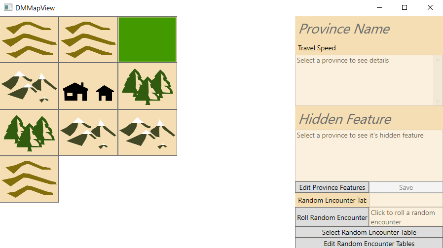
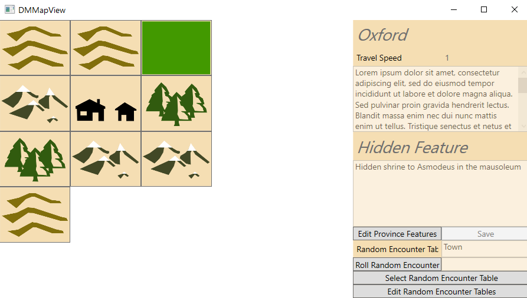
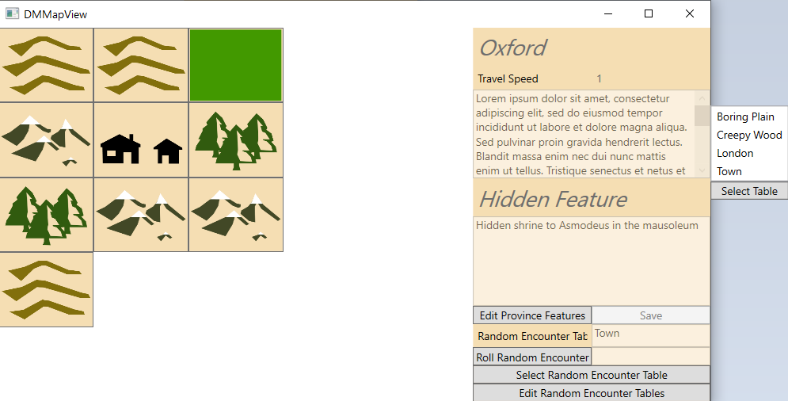
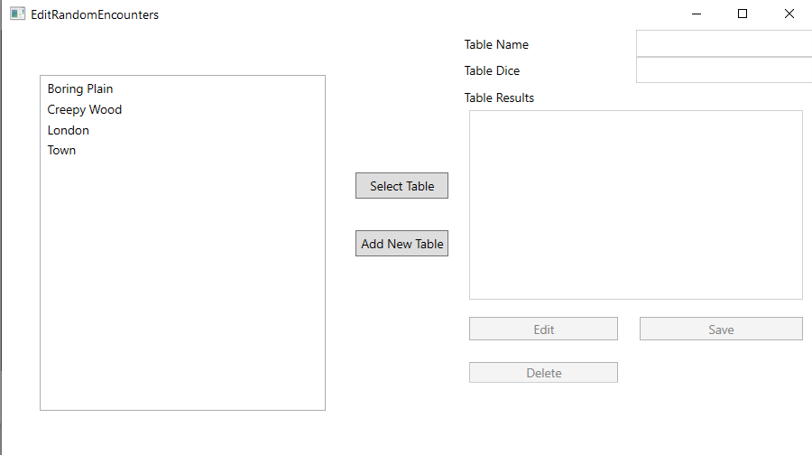

# User Readme


## Selecting Provinces



Upon clicking a map button the information about that province will be displayed, including the travel speed of it's terrain, and it's random encounter table.



To roll on the random encounter table of the province click the Roll Random Encounter button and the result will be displayed alongside. 

### Editing Provinces

By selecting Edit Province Features the text boxes of the province will be unlocked and available to edit. Once you have made your changes click save and your edits will be stored to be accessed anytime you return to the app. 

You may also edit the random encounter table associated with the province by selecting the "Select Random Encounter" button. This will display a pop-up along the righthand side of the app which contains a list of all the random encounter tables which are currently stored. Select a random encounter table from the list and click select to update the random encounter table of the province.




## Editing Random Encounter Tables

Selecting the "Edit Random Encounters" button opens a new window where you can see and select a random encounter table. 



Selecting a random encounter table will display it's details in the right hand side of the window.  


From here you can delete the table by selecting delete. You may also edit the table. The dice must be entered in the format `XdY` where `X` is the number of dice to be rolled and `Y` the size of the dice. Both `X` and `Y` must be positive non-zero integers.

The table must be entered in the format 
```{'value1':'result1', 'value2','result2', etc}``` 
Where the values are the possible results of the dice and the results the encounter that occurs when that value is rolled. For example if your table is a 1d4 table you must enter a table of the form 
```{'1':'result1', '2','result2', '3':'result3', '4':'result4'}``` 

Take care that each possible result is represented in the table, and note that for rolls of multiple dice the minimum possible result is the size of the dice. For example 2d4 has results 2 to 8, or 3d6 has results 3 to 18.

